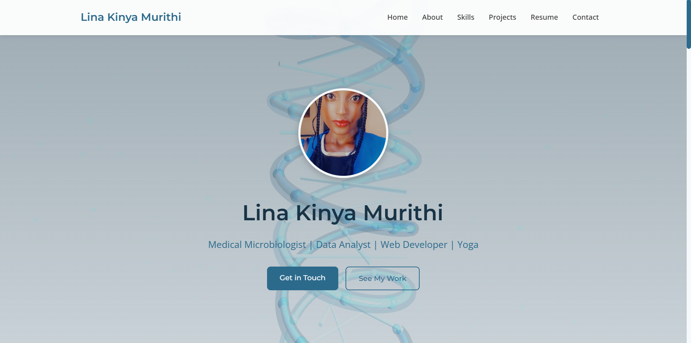

# Interactive Portfolio



An interactive portfolio website featuring 3D visualizations and animations built for the PowerLearnProject Portfolio Challenge Hackathon.

## Project Team

This portfolio was created by:

* Nelson Masbayi Muyodi - Web development, 3D implementation, and interactive features
* Lina Kinya Murithi - Web development, CSS Styling, Content and design direction

**Peer Group 652 - PLP February 2025 Cohort VII**

_Created as part of the PowerLearnProject Portfolio Challenge Hackathon 2025_

## Project Attribution

This project builds upon and enhances Lina's original portfolio repository:
[https://github.com/Ar-murithi/personal-portfolio](https://github.com/Ar-murithi/personal-portfolio)

The enhancements include:
- Implementation of Three.js for 3D visualizations
- Interactive DNA helix background
- 3D skills sphere visualization
- Animated timeline for professional experience
- Lab-themed visual elements and interactions
- Enhanced responsive design and animations

## Features

- **Interactive 3D Elements**:
    - DNA helix animation in hero section representing microbiology background
    - 3D skills visualization with categorized abilities
    - Timeline with flowing particles showing professional journey

- **Scientific/Laboratory Theme**:
    - Color scheme inspired by laboratory settings
    - Decorative molecular elements
    - Special microscope view for projects

- **Modern Web Technologies**:
    - HTML5 and CSS3 with responsive design
    - JavaScript for interactive elements
    - Three.js for 3D visualizations

## Project Structure

- `index.html` - Main HTML structure
- `css/` - Styling files
    - `style.css` - Main stylesheet
- `js/` - JavaScript files
    - `main.js` - Core functionality
    - `three-effects.js` - 3D visualizations
- `images/` - Image assets
- `CV/` - Resume and documents

## View Live Demo

The live portfolio can be viewed at: [https://nmsby.github.io/plp-hackathon-portfolio/](https://nmsby.github.io/plp-hackathon-portfolio/)

## Setup and Installation

1. Clone the repository:
```bash
  git clone https://github.com/your-username/lina-portfolio.git
```

2. Navigate to the root directory:
```
cd lina-portfolio
```

3. Open `index.html` in your browser to view the portfolio locally.


4. For the best experience:
   - Use a modern browser (Chrome, Firefox, Edge) 
   - View on a desktop/laptop device
   - Use a mouse for interactive elements

## Credits

- Three.js for 3D visualization
- Font Awesome for icons
- Google Fonts for typography

## License

This project is licensed under the MIT License - see the LICENSE file for details.